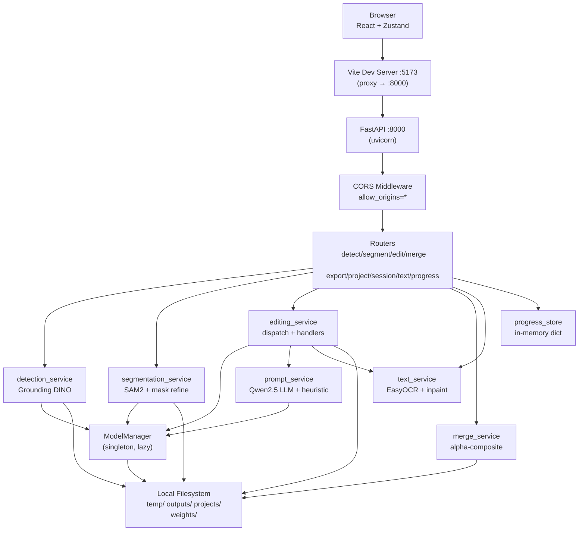
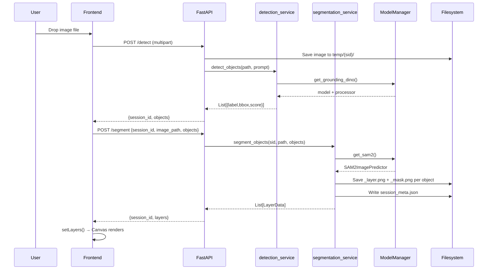

# AI Image Editor — Complete Architecture & Flow Documentation

> Generated by code inspection on 2026-08-14. All file paths, function names, and behaviors are confirmed from source.

---

## 1. PROJECT OVERVIEW

A fully local, browser-based AI image editor. The user uploads any photo; the backend automatically detects every object with Grounding DINO, segments each one with SAM2 into a transparent RGBA PNG layer, and presents them in a Photoshop-style layer panel. The user then edits individual layers with natural-language prompts. An LLM (Qwen2.5-0.5B) parses the prompt into a structured edit command that is routed to the correct handler — PIL transforms, OpenCV filters, rembg background removal, Real-ESRGAN upscaling, EasyOCR text editing, or FLUX/SDXL inpainting. All layers are alpha-composited on export.

**Stack:**
- Frontend: React 18 + TypeScript + Vite 5 + Zustand + Tailwind CSS + Lucide icons
- Backend: FastAPI + Uvicorn (Python 3.11/3.12)
- AI: Grounding DINO (transformers), SAM2 / SAM (segment-anything), Qwen2.5-0.5B (transformers pipeline), FLUX.1-dev inpaint / SDXL inpaint (diffusers), Real-ESRGAN (basicsr/realesrgan), rembg u2net (onnxruntime), EasyOCR
- Storage: local filesystem only — no database, no auth, no external APIs
- Deployment: Docker Compose (nvidia/cuda:11.8 base) or bare-metal; optional ngrok tunnel for Colab

**Environment modes** (`ENV` env var):
- `local` → paths under project root (`temp/`, `outputs/`, `projects/`, `weights/`)
- `server` (default) → paths under `/content/drive/MyDrive/project_folders/` (Google Colab/Drive)

---

## 2. COMPLETE PROJECT STRUCTURE

```
editor/
├── backend/
│   ├── main.py                  # FastAPI app, router registration, lifespan
│   ├── schemas.py               # All Pydantic request/response models
│   ├── requirements.txt         # Python dependencies
│   ├── routers/
│   │   ├── detect.py            # POST /detect
│   │   ├── segment.py           # POST /segment
│   │   ├── layers.py            # POST /layers
│   │   ├── edit.py              # POST /edit
│   │   ├── merge.py             # POST /merge
│   │   ├── export.py            # POST /export
│   │   ├── project.py           # POST /project/save, /project/load, GET /project/list, DELETE /project/{name}
│   │   ├── session.py           # GET /session/latest, /session/list, /session/{id}, DELETE /session/{id}
│   │   ├── progress.py          # GET /progress/{session_id}
│   │   └── text.py              # POST /text/detect, /text/erase-bg, /text/render
│   ├── services/
│   │   ├── model_manager.py     # Singleton lazy model loader/cache
│   │   ├── detection_service.py # Grounding DINO inference
│   │   ├── segmentation_service.py # SAM2 inference + mask refinement + PNG export
│   │   ├── editing_service.py   # Edit dispatch + all edit handlers
│   │   ├── prompt_service.py    # LLM prompt parsing + heuristic fallback
│   │   ├── merge_service.py     # Alpha-composite all layers
│   │   ├── text_service.py      # EasyOCR detect + inpaint erase + render new text
│   │   └── progress_store.py    # In-memory progress dict
│   ├── utils/
│   │   └── config.py            # Path config (ENV-aware)
│   └── tests/
│       ├── test_editing_service.py
│       ├── test_merge_service.py
│       └── test_prompt_service.py
├── frontend/
│   ├── src/
│   │   ├── main.tsx             # React entry point
│   │   ├── App.tsx              # Root component, session restore on mount
│   │   ├── config.ts            # baseUrl (ngrok or localhost)
│   │   ├── store/
│   │   │   └── editorStore.ts   # Zustand store (persisted to localStorage)
│   │   ├── api/
│   │   │   └── client.ts        # Axios API client, all backend calls
│   │   ├── types/
│   │   │   └── index.ts         # TypeScript interfaces (LayerData, Tool, etc.)
│   │   ├── hooks/
│   │   │   ├── useKeyboardShortcuts.ts
│   │   │   ├── useProgressPoller.ts
│   │   │   └── useBlobUrl.ts
│   │   └── components/
│   │       ├── Canvas.tsx       # Main canvas, layer rendering, pan/zoom, inline text editor
│   │       ├── LayerPanel.tsx   # Layer list sidebar
│   │       ├── PropertiesPanel.tsx # Edit prompt UI, text editing UI, style presets
│   │       ├── Toolbar.tsx      # Tool buttons, undo/redo, save, export
│   │       ├── ImageUploader.tsx # Drag-drop upload → detect → segment
│   │       ├── ExportModal.tsx  # Export format/upscale options
│   │       ├── ProjectManager.tsx # Save/load/delete projects
│   │       ├── HistoryPanel.tsx # Undo/redo history display
│   │       └── ProgressBar.tsx  # Progress indicator
│   ├── vite.config.ts           # Vite dev server + proxy rules
│   └── package.json
├── weights/                     # Downloaded model weights (auto)
│   ├── grounding_dino/          # IDEA-Research/grounding-dino-base (HF cache)
│   ├── sam2/sam2_hiera_large.pt
│   ├── sam/sam_vit_h_4b8939.pth (fallback)
│   ├── qwen/                    # Qwen2.5-0.5B-Instruct (HF cache)
│   ├── sdxl_inpaint/            # diffusers/stable-diffusion-xl-1.0-inpainting-0.1
│   ├── sdxl_img2img/            # stabilityai/stable-diffusion-xl-base-1.0
│   ├── realesrgan/RealESRGAN_x4plus.pth
│   └── flux/                    # black-forest-labs/FLUX.1-dev (if VRAM allows)
├── temp/                        # Per-session working files
│   └── {session_id}/
│       ├── {original_image}
│       ├── {layer_id}_layer.png
│       ├── {layer_id}_mask.png
│       ├── {layer_id}_edited_{uuid}.png
│       └── session_meta.json
├── outputs/                     # Merged/exported images
├── projects/                    # Saved project JSON files
├── Dockerfile                   # nvidia/cuda:11.8 base
├── docker-compose.yml
├── environment.yml              # Conda env
├── start.sh / start.bat
└── install.sh / install.bat

| Path | Purpose | Depends On | Used By | Importance |
|------|---------|------------|---------|------------|
| `backend/main.py` | App entry, router mount, CORS, lifespan | All routers, config | uvicorn | Core |
| `backend/schemas.py` | All Pydantic models | pydantic | All routers + services | Core |
| `backend/utils/config.py` | Path resolution (ENV-aware) | os, pathlib | All services + routers | Core |
| `backend/services/model_manager.py` | Singleton AI model loader | torch, transformers, diffusers | detection, segmentation, editing, export | Core |
| `backend/services/detection_service.py` | Grounding DINO object detection | model_manager | routers/detect | Core |
| `backend/services/segmentation_service.py` | SAM2 segmentation + PNG layers | model_manager, config | routers/segment, routers/layers | Core |
| `backend/services/editing_service.py` | Edit dispatch + all handlers | model_manager, prompt_service, text_service | routers/edit | Core |
| `backend/services/prompt_service.py` | LLM prompt parsing + heuristic | model_manager | editing_service | Core |
| `backend/services/merge_service.py` | Alpha-composite layers | schemas, config | routers/merge, routers/export | Core |
| `backend/services/text_service.py` | EasyOCR + text erase + render | cv2, PIL, easyocr | editing_service, routers/text | Core |
| `backend/services/progress_store.py` | In-memory progress dict | schemas | routers/progress, all routers | Core |
| `backend/routers/session.py` | Session restore/list/delete | config | App.tsx on mount | Core |
| `frontend/src/store/editorStore.ts` | All frontend state (Zustand+persist) | zustand | All components | Core |
| `frontend/src/api/client.ts` | All HTTP calls to backend | axios, config.ts | All components | Core |
| `frontend/src/config.ts` | baseUrl (ngrok or localhost) | — | client.ts, Canvas.tsx, LayerPanel.tsx | Core |
| `frontend/src/components/Canvas.tsx` | Layer rendering, pan/zoom, inline text | editorStore, useBlobUrl | App.tsx | Core |
| `frontend/src/components/PropertiesPanel.tsx` | Edit prompt, text editing UI | editorStore, client.ts | App.tsx | Core |
| `frontend/src/components/ImageUploader.tsx` | Upload → detect → segment flow | client.ts, editorStore | App.tsx | Core |
| `temp/{session_id}/session_meta.json` | Session persistence on disk | — | session router, edit router | Core |
| `projects/{name}.json` | Saved project state | — | project router | Optional |

---
```
## 3. ARCHITECTURE



**Communication:** All frontend↔backend communication is synchronous HTTP (axios). No WebSockets. Progress is polled via `GET /progress/{session_id}` every 800ms by `useProgressPoller`. No message queue. No background workers — all AI inference runs synchronously in the FastAPI request handler thread.

---

## 4. COMPLETE REQUEST/RESPONSE FLOW

### 4.1 Image Upload → Detect → Segment (primary onboarding flow)

```
User drops/selects image file
  ↓ ImageUploader.tsx → processFile()
  ↓ POST /detect  (multipart: file + optional prompt)
    → routers/detect.py → detect()
      → uuid.uuid4().hex → session_id
      → saves file to temp/{session_id}/{filename}
      → detection_service.detect_objects(image_path, prompt)
        → model_manager.get_grounding_dino() [lazy load]
        → processor(images, text) → inputs.to(DEVICE)
        → model(**inputs) → outputs
        → processor.post_process_grounded_object_detection() → results
        → manual score filter (box_threshold=0.25)
        → returns List[{label, score, bbox{x,y,width,height}}]
      → set_progress(session_id, "detect", 1.0, done=True)
      → returns DetectResponse{objects, session_id}
  ↓ Frontend: setSession(session_id, image_path, blobUrl, w, h)
  ↓ POST /segment  {session_id, image_path, objects}
    → routers/segment.py → segment()
      → segmentation_service.segment_objects(session_id, image_path, objects)
        → model_manager.get_sam2() [lazy load]
        → Image.open(image_path) → np.array
        → predictor.set_image(image_np)
        → for each object:
            predictor.predict(box=bbox_array, multimask_output=True)
            → best mask by argmax(scores)
            → refine_mask(raw_mask):
                cv2.morphologyEx MORPH_CLOSE (kernel 7x7, iter=2)
                cv2.floodFill from corner → fill interior holes
                cv2.morphologyEx MORPH_OPEN (iter=1)
                cv2.GaussianBlur (5x5)
            → mask_to_transparent_png() → RGBA PNG cropped to bbox
            → layer_id = f"{session_id}_{idx}_{uuid4().hex[:6]}"
            → saves {layer_id}_mask.png, {layer_id}_layer.png to temp/{session_id}/
            → LayerData(id, name, mask_path=/temp/..., png_path=/temp/..., bbox, z_index)
        → writes session_meta.json to temp/{session_id}/
        → returns List[LayerData]
      → returns SegmentResponse{session_id, layers}
  ↓ Frontend: setLayers(layers) → Canvas renders layer images
```

### 4.2 Edit Layer Flow

```
User selects layer, types prompt, clicks Apply (or Ctrl+Enter)
  ↓ PropertiesPanel.tsx → editLayer(api/client.ts)
  ↓ POST /edit  {session_id, layer_id, prompt, image_path, strength, guidance_scale, steps, edit_type?, edit_params?}
    → routers/edit.py → edit()
      → glob session_dir for {layer_id}_layer*.png and {layer_id}_mask*.png
      → resolve original image path from req.image_path
      → editing_service.edit_layer(...)
        → prompt_service.parse_edit_prompt(prompt, layer_name)
          → model_manager.get_llm() [lazy load Qwen2.5-0.5B]
          → llm([system_prompt, user_msg], max_new_tokens=256)
          → regex extract JSON from output
          → post-process: force recolor if color word detected
          → fallback: _heuristic_parse() if LLM fails/no JSON
          → returns {target_object, target_region, edit_type, edit_params, inpaint_prompt}
        → check RAM (CUDA: <6GB → block generative; CPU: <5.5GB → block)
        → dispatch to handler by edit_type:
            recolor/replace/generative_fill/anime/oil_painting/other → _inpaint()
            style_transfer → _style_transfer() → _run_img2img_on_layer()
            blur/sharpen/brightness/contrast/saturation → PIL ImageEnhance/ImageFilter
            cartoon/sketch/pixel_art → OpenCV transforms
            background_remove → rembg.remove()
            erase → putalpha(0)
            upscale → Real-ESRGAN
            text_edit → text_service.edit_text_in_image()
        → after AI handlers: unload model (gc.collect + cuda.empty_cache)
        → result.save(temp/{session_id}/{layer_id}_edited_{uuid8}.png)
        → returns absolute path
      → converts to /temp/{session_id}/... URL
      → updates session_meta.json png_path for this layer
      → returns EditResponse{layer_id, edited_png_path, session_id}
  ↓ Frontend: updateLayer(layer_id, {png_path: edited_png_path})
  ↓ Canvas re-renders with new image via useBlobUrl()
```

### 4.3 Export Flow

```
User clicks Export → ExportModal → selects format + upscale
  ↓ POST /export  {session_id, layers, canvas_width, canvas_height, format, upscale, upscale_factor}
    → routers/export.py → export_image()
      → merge_service.merge_layers(layers, w, h)
        → sort visible layers by z_index ascending
        → for each layer:
            _resolve(png_path) → absolute filesystem path
            Image.open().convert("RGBA")
            apply opacity (scale alpha channel)
            apply rotation (Image.rotate)
            apply scale (Image.resize)
            paste at (bbox.x + position.x, bbox.y + position.y) on tmp canvas
            Image.alpha_composite(canvas, tmp)
        → returns final RGBA Image
      → if upscale: model_manager.get_realesrgan(factor) → upsampler.enhance()
      → save to outputs/export_{uuid8}.{fmt}
        JPEG: flatten to RGB with white bg
        WebP: quality=90
        PNG: direct save
      → returns FileResponse (binary download)
  ↓ Frontend: URL.createObjectURL(blob) → trigger download
```

### 4.4 Session Restore Flow

```
App.tsx useEffect on mount (if no originalImageUrl in store)
  ↓ GET /session/latest
    → session.py → get_latest_session()
      → scan TEMP_DIR for dirs with session_meta.json
      → pick most recently modified
      → validate all layer PNGs exist on disk
      → validate original image exists
      → returns {session: meta} or {session: null}
  ↓ if session: fetch image blob → setSession() + setLayers()
  ↓ toast.info("Resumed last session")
```
# Architecture


---

## 5. DATA FLOW

### LayerData lifecycle

```
Created in segmentation_service.segment_objects()
  id:        "{session_id}_{idx}_{uuid4().hex[:6]}"
  name:      Grounding DINO label string
  mask_path: "/temp/{session_id}/{layer_id}_mask.png"   ← URL path
  png_path:  "/temp/{session_id}/{layer_id}_layer.png"  ← URL path
  bbox:      {x, y, width, height} in original image pixels
  z_index:   len(objects) - idx  (first detected = highest z)
  visible:   true
  opacity:   1.0
  position:  {x:0, y:0}  (user-draggable offset)
  scale:     {x:1, y:1}
  rotation:  0.0
  history:   []
  locked:    false

After edit:
  png_path updated to "/temp/{session_id}/{layer_id}_edited_{uuid8}.png"
  session_meta.json updated on disk

Stored in:
  - Zustand editorStore.layers[] (in-memory + localStorage via persist)
  - temp/{session_id}/session_meta.json (disk)
  - projects/{name}.json (disk, on explicit save)

Consumed by:
  - Canvas.tsx: renders each layer as  at bbox position
  - LayerPanel.tsx: shows thumbnail + controls
  - PropertiesPanel.tsx: edit target
  - merge_service: composites into final image
  - export router: final download
```

### Image file naming convention

```
Original:  temp/{session_id}/{original_filename}
Mask:      temp/{session_id}/{session_id}_{idx}_{hex6}_mask.png
Layer PNG: temp/{session_id}/{session_id}_{idx}_{hex6}_layer.png
Edited:    temp/{session_id}/{session_id}_{idx}_{hex6}_edited_{hex8}.png
Text bg:   temp/{session_id}/{layer_id}_bg_{hex8}.png
Text patch:temp/{session_id}/textpatch_{hex8}.png
Merged:    outputs/{session_id}_merged_{hex6}.{fmt}
Export:    outputs/export_{hex8}.{fmt}
Project:   projects/{project_name}.json
```

---

## 6. DATABASE / STORAGE

There is no database. All persistence is filesystem-based.

| Storage | Path | Format | Contents |
|---------|------|--------|----------|
| Session working files | `temp/{session_id}/` | PNG + JSON | Layer PNGs, masks, edited PNGs, session_meta.json |
| Session metadata | `temp/{session_id}/session_meta.json` | JSON | session_id, image_path, layers[] |
| Project saves | `projects/{name}.json` | JSON | Full SaveRequest payload (all LayerData + canvas state) |
| Exported images | `outputs/export_{uuid}.{fmt}` | PNG/JPEG/WebP | Final composited image |
| Merged previews | `outputs/{sid}_merged_{hex}.{fmt}` | PNG/JPEG/WebP | Intermediate merge result |
| Model weights | `weights/` | .pth / HF cache | AI model files |
| Frontend state | `localStorage["editor-store"]` | JSON | Zustand persisted state |

**session_meta.json structure:**
```json
{
  "session_id": "hex32",
  "image_path": "relative/path/to/original.jpg",
  "layers": [ /* array of LayerData dicts */ ]
}
```

**Project JSON structure** (confirmed from `projects/my_project.json`):
```json
{
  "session_id": "...",
  "project_name": "...",
  "original_image_path": "temp/{sid}/{filename}",
  "layers": [ /* LayerData[] */ ],
  "canvas_width": 539,
  "canvas_height": 360,
  "canvas_position": {"x": 0.0, "y": 0.0},
  "settings": {},
  "prompts": []
}
```

---

## 7. TOOLS / FUNCTIONS / SERVICES

| Tool/Service | File | Input | Output | Called By | Calls | Side Effects |
|---|---|---|---|---|---|---|
| `detect_objects` | `services/detection_service.py` | image_path, prompt? | List[{label,score,bbox}] | routers/detect | model_manager.get_grounding_dino | None |
| `segment_objects` | `services/segmentation_service.py` | session_id, image_path, objects | List[LayerData] | routers/segment, routers/layers | model_manager.get_sam2, refine_mask, mask_to_transparent_png | Writes PNGs + session_meta.json to temp/ |
| `refine_mask` | `services/segmentation_service.py` | np.ndarray (bool mask) | np.ndarray (uint8 0-255) | segment_objects | cv2 morphology + GaussianBlur | None |
| `mask_to_transparent_png` | `services/segmentation_service.py` | image_np, mask, bbox, out_path | None | segment_objects | PIL, cv2 | Writes PNG file |
| `edit_layer` | `services/editing_service.py` | session_id, layer_id, layer_name, paths, prompt, params | str (output path) | routers/edit | parse_edit_prompt, all _handler funcs, model_manager | Writes edited PNG; unloads AI model after use |
| `parse_edit_prompt` | `services/prompt_service.py` | user_prompt, layer_name | dict {edit_type, edit_params, inpaint_prompt, ...} | edit_layer | model_manager.get_llm, _heuristic_parse | None |
| `_heuristic_parse` | `services/prompt_service.py` | prompt, layer_name | same dict | parse_edit_prompt | None | None |
| `merge_layers` | `services/merge_service.py` | List[LayerData], canvas_w, canvas_h | PIL.Image (RGBA) | routers/merge, routers/export | _resolve, PIL alpha_composite | None |
| `edit_text_in_image` | `services/text_service.py` | orig_img, params{replacements} | PIL.Image | editing_service._text_edit | _get_reader (EasyOCR), _build_glyph_mask, cv2.inpaint, render_text_patch | None |
| `detect_text` | `services/text_service.py` | PIL.Image | List[{quad,bbox,text,color,font_size,conf}] | routers/text /detect | _get_reader (EasyOCR) | Lazy-loads EasyOCR |
| `erase_text_regions` | `services/text_service.py` | PIL.Image, regions | PIL.Image | routers/text /erase-bg | _build_glyph_mask, LaMa or cv2.inpaint | None |
| `render_text_patch` | `services/text_service.py` | region, new_text, overrides | PIL.Image (RGBA patch) | routers/text /render | _load_font, _fit_text, PIL.ImageDraw | None |
| `set_progress` / `get_progress` | `services/progress_store.py` | session_id, task, progress, message, done | ProgressResponse | All routers | None | Mutates in-memory dict |
| `ModelManager.get_grounding_dino` | `services/model_manager.py` | — | (model, processor) | detection_service | transformers AutoModelForZeroShotObjectDetection | Lazy-loads, caches in _instance |
| `ModelManager.get_sam2` | `services/model_manager.py` | — | SAM2ImagePredictor | segmentation_service | sam2.build_sam2, SAM2ImagePredictor; fallback: segment_anything | Lazy-loads; downloads weights if missing |
| `ModelManager.get_inpaint_pipe` | `services/model_manager.py` | — | FluxInpaintPipeline or StableDiffusionXLInpaintPipeline | editing_service._inpaint | diffusers | Lazy-loads; tries FLUX first, falls back to SDXL |
| `ModelManager.get_llm` | `services/model_manager.py` | — | HF text-generation pipeline | prompt_service | transformers pipeline (Qwen2.5-0.5B on CPU) | Lazy-loads |
| `ModelManager.get_realesrgan` | `services/model_manager.py` | scale:int | RealESRGANer | editing_service._upscale, export router | basicsr RRDBNet, realesrgan RealESRGANer | Downloads weights if missing |
| `ModelManager.get_rembg_session` | `services/model_manager.py` | — | rembg Session | editing_service._background_remove | rembg new_session("u2net") | Lazy-loads |
| `ModelManager.unload_inpaint_pipe` | `services/model_manager.py` | — | None | editing_service after AI edit | del + gc.collect + cuda.empty_cache | Frees VRAM |

